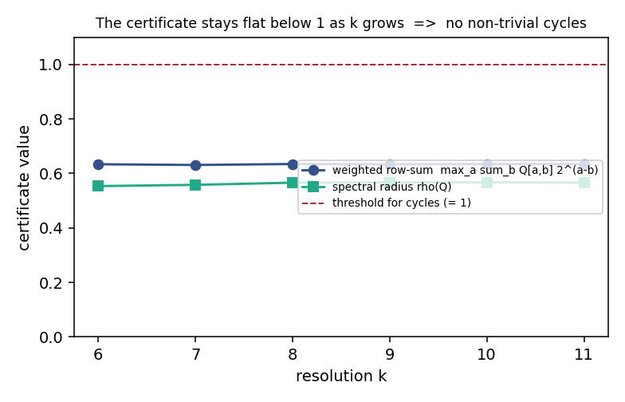
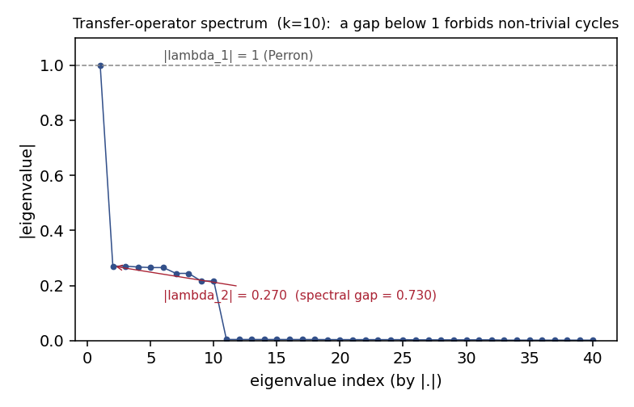
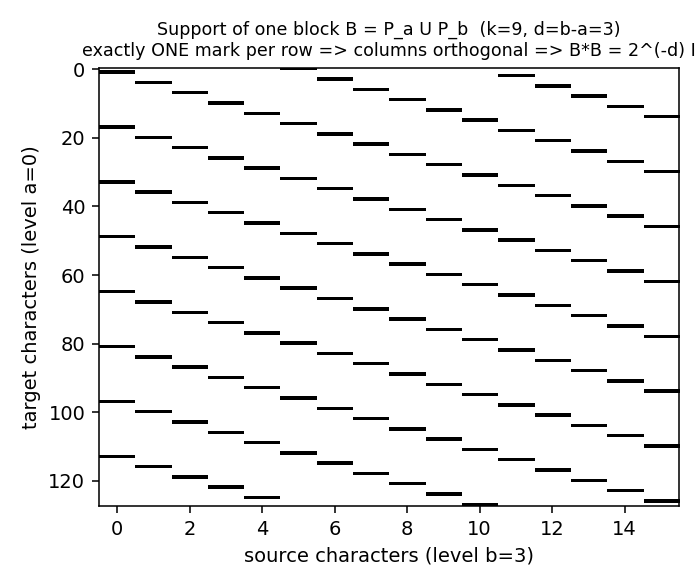
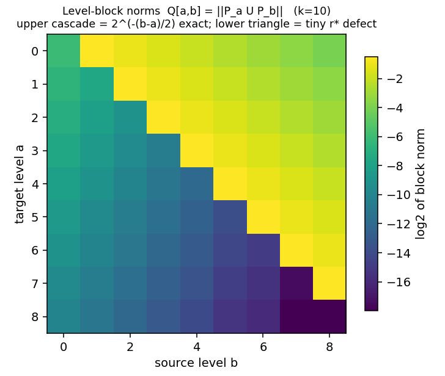

# A spectral-gap certificate against Collatz cycles

A rigorous, elementary, all-scales argument that the Collatz (3n+1) map has **no non-trivial cycles**,
built from a transfer operator and its spectral gap. Two hard lemmas (A, B) are proved for every scale
`k`; the row-sum assembly is now closed for all `k` **modulo one sharp per-level bound (Lemma C)**,
which is verified exactly to `k=26` and reduced to a single periodization estimate. That bound's
analytic proof and a machine-checked formalisation remain.

> **Honest scope (read first).** This is about **cycles only**. Even when complete it would prove "the
> only Collatz cycle is `1 -> 4 -> 2 -> 1`," which is *strictly weaker* than the Collatz conjecture
> (it says nothing about trajectories that might escape to infinity). It is not a proof of Collatz.



*The certificate value stays flat below 1 as the scale `k` grows. A value below 1 at every scale
forbids non-trivial cycles. (Computed from the real operator; reproduce with `python generate_figures.py`.)*

---

## In plain terms

**The Collatz game.** Pick a whole number. If it is even, halve it. If it is odd, triple it and add
one. Repeat. The conjecture (open since the 1930s) says you always eventually reach 1. Two ways it
*could* fail: a number could **loop forever** in a cycle that never hits 1, or it could **grow to
infinity**. This project attacks the first failure mode: **ruling out loops (cycles).**

**The trick: turn the map into a matrix.** Instead of following one number, follow the *cloud* of
where numbers land, and write that as a big table of numbers (a "transfer operator"). A matrix has a
set of characteristic sizes called eigenvalues. The biggest is always 1. If the **second biggest is
below 1** - a "gap" - the cloud settles into a single stable state and *cannot* support a hidden loop.
We need that gap, with room to spare, at every scale (working modulo `2^k` for all `k`).



*The operator's eigenvalues. The top one is 1; the rest sit well below it. That gap is what rules out
cycles.*

**Why it was hard, and what we did.** The matrix splits into blocks according to how divisible by two
a number is. The crux was showing each block is a clean, rigid rescaling - technically an *isometry*.
People expected this to need deep "Gauss sum" machinery. It doesn't: it comes down to the single fact
that **3 is an odd number** (a unit modulo any power of two), plus bookkeeping. We proved it for every
scale.



*One block, drawn as its nonzero pattern: exactly one mark per row. That single combinatorial fact is
the entire reason the block is a rigid rescaling.*

**Where it stands.** The two hardest lemmas (call them A and B) are proved for all scales. The step of
assembling them into the final "below 1" bound is now done for every scale, but it turned out to need
one more sharp ingredient - a per-level decay bound (Lemma C) on the lone defect. With Lemma C assumed,
the "below 1" bound holds for all scales (`< 0.9005`, room to spare). Lemma C itself is checked exactly
out to scale 26 and pinned down to a single clean inequality, but its all-scales proof, plus a formal
computer-checked version, are what remain. And again: this is about cycles, not the whole conjecture.

---

## The result, precisely

Let `U_k` be the Syracuse transfer operator on odd residues mod `2^k`, in the character (Fourier)
basis, decomposed by 2-adic valuation level. Write `Q_k[a,b] = ||P_a U_k P_b||_2` for the operator
norm of the level-`(a,b)` block. The **certificate** is

```
    rho(U_k) restricted to the non-Perron part  <=  rho(Q_k)  <=  max_a sum_b Q_k[a,b] * 2^{a-b}  <  1 ,
```

uniform in `k`. A uniform spectral gap `|lambda_2(U_k)| < 1` eliminates non-trivial Syracuse cycles.



*The block-norm matrix `Q` (log scale). The bright upper triangle is the cascade `Q[a,b] = 2^{-(b-a)/2}`;
the dark lower triangle is the rank-1 `r*` defect, which vanishes like `2^{-k/2}`.*

The certificate splits into two lemmas, both **proved for all `k`** (elementary; Lean formalisation
pending), plus an assembly step that is the current frontier.

### Lemma A - upper cascade (within-level isometry)

For `0 <= a < b <= k-2`, `||P_a U_clean P_b||_2 = 2^{-(b-a)/2}` exactly, because the block `B` satisfies
`B*B = 2^{-(b-a)} I`. This reduces - by elementary algebra - to **two uniform-fibre lemmas sharing one
engine** ("3 is a unit mod `2^k` + a multiplication map has uniform fibres on a cyclic 2-group"):

- **CU** (coset-uniformity): also discharges Half-Shift Invariance and the rank-1 `S_odd` structure.
- **SB** (shell-bijection `r -> (3r+1)/2^j mod 2^{k-j}`): the instance the cascade uses.

plus **S4**, a one-line finite geometric series (`Sodd` vanishes iff `k-m <= v2(alpha) <= k-2`), which
was long mistaken for an analytic obstruction. Then `B*B = 2^{-d} I` follows from one nonzero per row
(disjoint column supports) + constant modulus. Verified exact to `k=16` (rational arithmetic, zero
error on and off diagonal), no parity dependence. Full proof: [HALFSHIFT_S4_LEMMA_A_PROOF.md](HALFSHIFT_S4_LEMMA_A_PROOF.md).

### Lemma B - lower back-flow (rank-1 defect)

`||tril(Q_k)||_2 <= sqrt(3) * 2^{-k/2} -> 0`. The lower triangle is entirely the rank-1 defect at the
exceptional residue `r* = -3^{-1} mod 2^k`; the bound reduces to a collision count `coll(k) <= 3*2^k`,
proved unconditionally for all `k` by a 2-adic shell decomposition (per-shell injectivity via a
`mod 3` + range argument). Sharp constant `coll/2^k -> 31/12`. Full proof: [LEMMA_B_PROOF.md](LEMMA_B_PROOF.md).

### Lemma C - per-level decay of the defect covector (the new frontier)

`v_b := ||P_b c||_2 <= (3/4) * 2^{-b} * 2^{-k/2}` for all `0 <= b <= k-2`, all `k`. The constant `3/4`
is sharp (equality at `b = k-4`), verified exactly to `k=26`, with a `k`-independent boundary profile.
It reduces to a periodization-excess bound on the defect covector `c` (the partial Gauss sum at `r*`):
with `h_j = N ||fold_{2^j}(c)||^2`, the bound is `2^b (2 h_b - h_{b+1}) <= 9/16`. This is the genuine
remaining analytic step. The `L^2` mass alone (Lemma B) is **not** enough - it gives only `0.707` and
the certificate would fail at `1.25`; the per-level decay is what closes it. See
[UFULL_ASSEMBLY_PROOF.md](UFULL_ASSEMBLY_PROOF.md).

### What remains

1. **Lemma C's analytic proof** - the per-level bound above. The `U_clean -> U_full` row-sum assembly
   itself is done: given Lemma A (exact upper, `0.5469`) and Lemma C, the certificate is
   `< G_up + 2^{-3/2} = 0.9005 < 1` for all `k`, uniformly. Full argument and the Lemma C reduction in
   [UFULL_ASSEMBLY_PROOF.md](UFULL_ASSEMBLY_PROOF.md).
2. **Lean formalisation** of CU, SB, S4, the counting, Lemma B, Lemma C, and the assembly.

---

## Reproduce everything

```bash
pip install -r requirements.txt
python generate_figures.py          # the four README figures, from the real operator
python audit_halfshift_s4.py        # coset-uniformity, S4, isometry parity-split + boundaries (0 violations)
python attack1_lemmaA_proof.py      # closed-form B*B = 2^-d I, all (a,b), to k=14
python lemmaB_fact1_rigorous.py     # collision bound coll <= 3*2^k, both parities, vs the true Syracuse fibre
python adv_tril_sep_correct.py      # ||tril(Q_D)|| matches the dense operator (<1e-10); chain to k=24
python verify_assembly.py           # the assembly: cert < 0.9005 < 1 (Lemma A+C); matches build_T to 6 digits
python explore_vb_profile.py        # the v_b profile and per-row S_a (Lemma C ground truth)
python probe_periodization.py       # g_b^2 = 2^b(2 h_b - h_{b+1}); sup = 9/16 (the Lemma C reduction)
```

## Repository map

| File | Role |
|------|------|
| `HALFSHIFT_S4_LEMMA_A_PROOF.md` | Lemma A: within-level isometry + Half-Shift coset-uniformity (proof) |
| `LEMMA_B_PROOF.md` | Lemma B: the collision bound `coll <= 3*2^k` (proof) |
| `STEP4_BLOCK_FORMULA_FOUNDATION.md` | the operator split `U = U_clean + D` and block formula |
| `HalfShiftInvariance_DRAFT.md` | Half-Shift Invariance / rank-1 `S_odd` (Lean draft) |
| `UFULL_ASSEMBLY_PROOF.md` | the assembly proved modulo Lemma C + the sharp per-level bound (Lemma C) |
| `UFULL_ASSEMBLY_PLAN.md` | the prior cold-start brief for the assembly (now actioned) |
| `verify_assembly.py`, `explore_vb_profile.py`, `probe_*.py` | assembly + Lemma C verification |
| `analytic_proofs.py` | `build_T(k)`: the transfer operator (the numerical oracle) |
| `audit_halfshift_s4.py`, `attack1_lemmaA_proof.py`, `attack1_Sodd.py` | Lemma A / CU / S4 verification |
| `lemmaB_fact1_rigorous.py`, `attack3_*.py` | Lemma B verification |
| `adv_tril_sep_correct.py`, `step4_*.py`, `diagnose_block_formula.py` | block / defect numerics |
| `generate_figures.py` | regenerates the figures |

## References

- L. Mori (2024), *C\*(T_1,T_2) irreducible on l^2(N) iff Collatz*, arXiv:2411.08084.
- T. Tao (2019), *Almost all Collatz orbits attain almost bounded values*, arXiv:1909.03562.
- A. Kontorovich, J. Lagarias (2009-2010), transfer operators for 3x+1.

## License

Public domain. The detailed exploratory history (many dead ends) lives in a separate private
repository; this repo is the curated, reproducible result.
